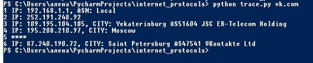

#Трассировка автономных систем.

По заданному ip адресу или доменному имени программа возвращает информацию о
маршрутизаторах, через которые проходит пакет до пункта назначения, введенного
пользователем (номер маршрутизатора в пути, ip адрес; если можно узнать, то номер автономной системы, страну, регион, город).

#Запуск:

Программа запускается через комадную строку командой:

python trace.py {доменное имя или ip}

#Пример
