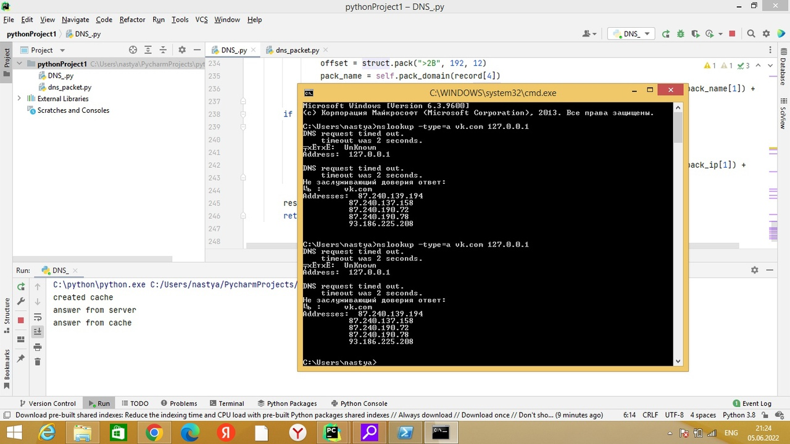

Кэширующий DNS сервер.
Сервер прослушивает 53 порт. При первом запуске кэш пустой. Сервер получает от клиента рекурсивный запрос и выполняет разрешение запроса. Получив ответ, сервер разбирает пакет ответа, извлекает из него ВСЮ (в том
числе из полей Authority и Additional) полезную информацию, т. е. все ресурсные записи, а не
только то, о чем спрашивал клиент. Полученная информация сохраняется в кэше сервера.
Сервер регулярно просматривает кэш и удаляет просроченные записи (использует поле TTL)

Поддерживаются запросы типа a, ns

Запуск

py DNS_.py --port <порт для прослушивания> <ip старшего днс сервера> --ttl <время жизни записи в кэше>

Пример:

--port 53 8.8.8.8 --ttl 3600

