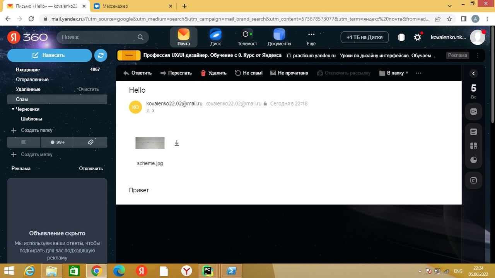

SMTP клиент.

Файл smtp.py отвечает за корректное установление соединения, авторизацию, создание и отправку сообщения с вложенными файлами по указанным адресам. Для этого он просит на вход полный путь до директории, в которой лежат необходимые данные для отправки сообщений, валидные логин и пароль для авторизации.

Содержимое папки с данными для отправки сообщения:
/config.txt: To: <адреса получателей через пробел>
             Theme: <тема письма>
             Files: <имена файлов для отправки через пробел>

адреса получателей имеют формат <>@<mail|yandex|rambler>.ru тема письма может быть как на русском, так и на английском языке, файлы для отправки должны лежать в папке files файлы могут иметь типы jpeg|jpg|png|txt|pdf

/text.txt: обычный текст на русском или английском языке в кодировке UTF-8

/files: файлы для отправки, указанные в config.txt, будут искаться в этой папке, поэтому для корректной отправки всех вложений необходимо обеспечить их наличие здесь

Необходимые модули:

base64, argparse

Запуск:

py smtp.py -d <путь к директории с данными для отправки> -l <логин отправителя> -p <пароль отправителя>

письмо отправленное по исходным данным из папки test:

